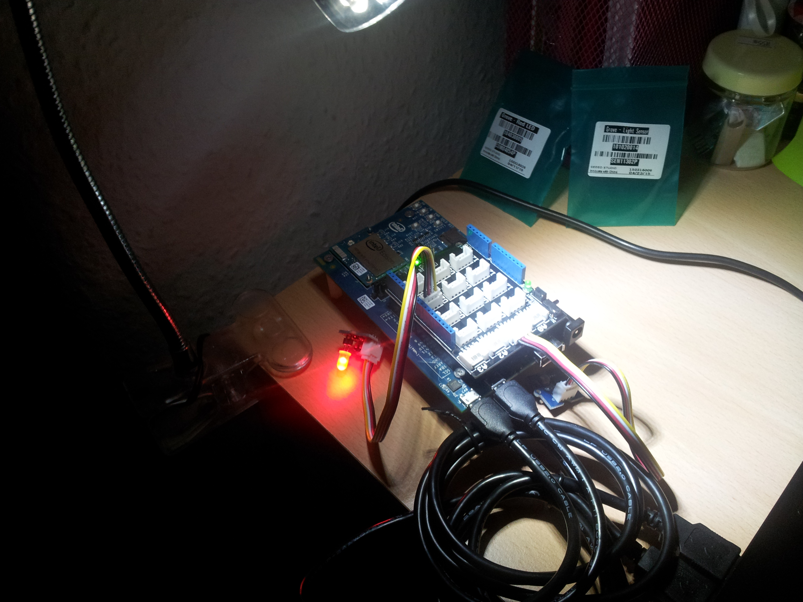
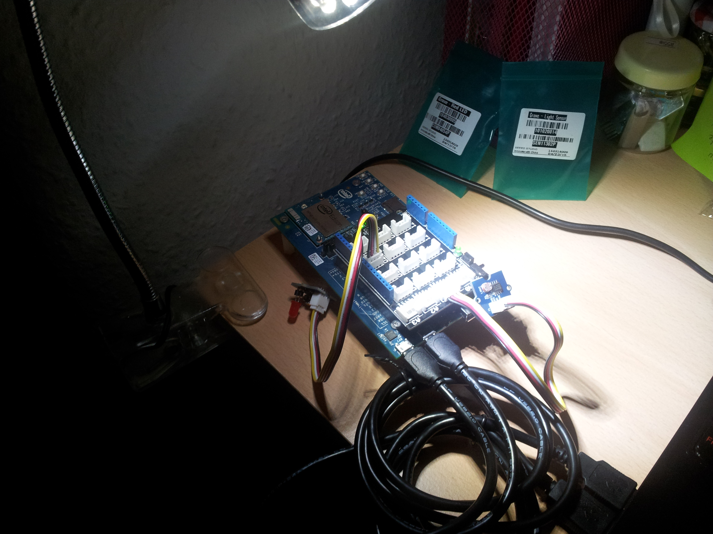

Overview
========

This example involves a light sensor and a red LED. 

- When the value of the light sensor goes below 700 then the red LED should turn on. 
- The sampling time is 500ms.
- The _light sensor_ is plugged on the _analog port A1_.
- The _red LED_ is plugged on the _digital port 2 (D2)_.
- After sampling and parsing the sensor information something is printed on the _serial port channel_.

On the ARDUINO IDE open the __Serial Monitor__ from the __Tools__ drop down menu.

The output on the serial monitor should be similar to the following one (it should dynamically change according to the light level, use a torch to change it or move the sensor trying to cover it from the light):

```
Low light level! 413
Low light level! 354
Low light level! 343
Low light level! 306
Low light level! 351
Light level is fine: 722
Light level is fine: 746
Light level is fine: 744
Light level is fine: 750
Light level is fine: 752
Light level is fine: 751
Low light level! 396
Low light level! 406
Low light level! 407
Low light level! 406
Low light level! 408
Low light level! 411
Low light level! 404
```

The red LED is switched on, the light sensor is covered by the board's shadow.


The red LED is switched off, the light sensor is under the lamp light.

