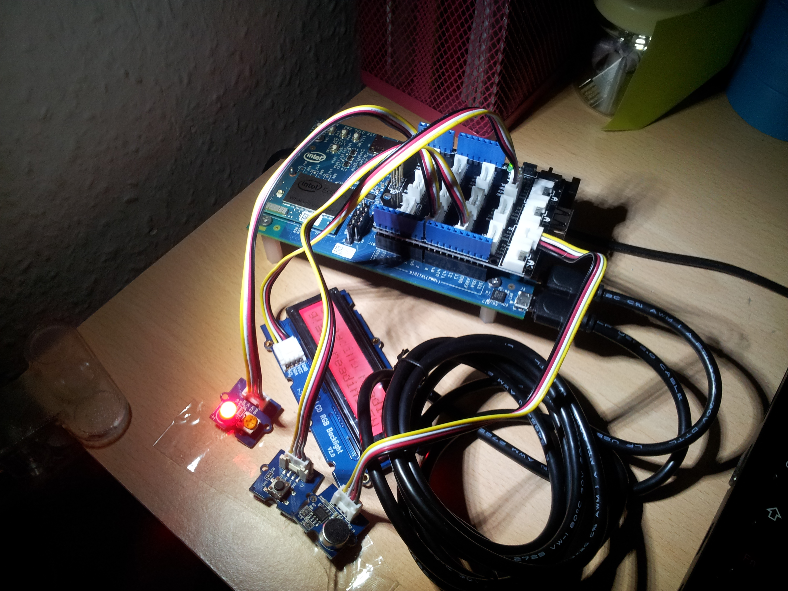
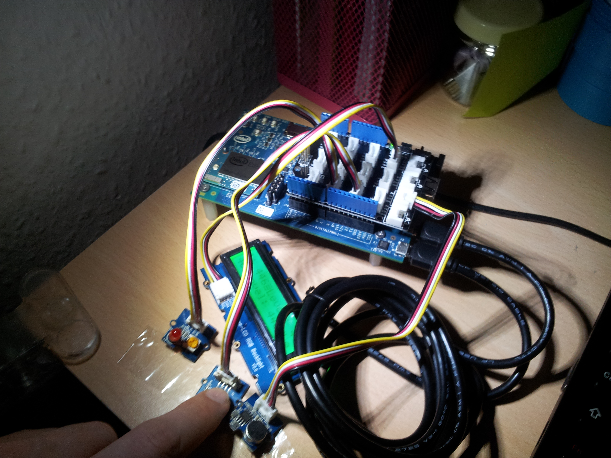

Sound sensor enabled by a button
================================

- The board reads the value coming from the sound sensor only when the button is pushed down.
- The information regarding the value from the sound sensor and the button status is printed both:
   - on the Serial Channel (on Linux that's `/dev/ttyACM0`),
   - on the LCD display. 
- When the board is not reading anything from the sound sensor (i.e. the button is not pushed down) then the red LED is switched on.

Hardware items
--------------

As usual the Intel Edison with the Arduino Expansion Board.

All the items come from the _Seeed Grove Starter Kit Plus_:

 - sound sensor (Grove SEN12945P),
 - button (Grove COM22242P),
 - red LED (Grove COM04054P),
 - LCD RGB backlight (Grove 811004001).

Software
--------

This small project has an external dependency to drive the LCD display behaviour. It comes from the (Seeed GitHub account)[https://github.com/Seeed-Studio/Grove_LCD_RGB_Backlight], on its (website page)[http://www.seeedstudio.com/wiki/Grove_-_LCD_RGB_Backlight] there's more technical information about it.
This `rgb_lcd` library has been added to this code base to get started quickly. To add the `rgb_lcd` library to your project you need to get the Arduino IDE to find your `rgb_lcd.h` and `rgb_lcd.cpp` files.

On the Arduino IDE:

 1. Click on __File > Preferences__
 2. then on the __Sketchbook location__ you need to provide this current path where the files are along with the `.ino` file
 3. then you need to close and open again the Arduino IDE.

Setup
-----

As you can see from the pictures:

 - the red LED is on the left,
 - then there's the button,
 - then there's the sound sensor,
 - behind the first row there's the LCD,
 - in the background you can see the Edison board.

When the button is not pushed then the red LED is on, the LCD background is red and no values are parsed from the sensor.

When the button is pushed down then the red LED is off, the LCD background is green and the values parsed from the sensor are displayed both on the LCD display and on the Serial Channel.

